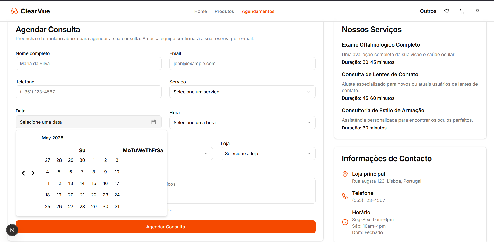

[Back to main Logbook Page](../hci_logbook.md)

---

# E. Functional Prototype and Evaluation

# Prototype

# E.X. User Evaluation

We tested our work with two groups of users, one group of 2 people and another group of 3 people. The groups tested the application and gave us feedback on the interface, functionalities, and usability.

- **Grupo 1**: 
    This group tested the application from start to finish, from product purchase to appointment scheduling. The main highlight was the calendar on the scheduling page, which was misaligned.
    They also suggested adding more notifications and fixing some bugs in the scheduling process. They found the interface simple and intuitive, and the functionalities useful.

- **Grupo 2**:
    The feedbacks were similar to group 1, but they also suggested making some changes to the navigation menu, as we have a submenu "others" that is not very intuitive. They suggested that it be changed to a side menu with all the other functionalities.
    

---
[Back to main Logbook Page](../hci_logbook.md)

---