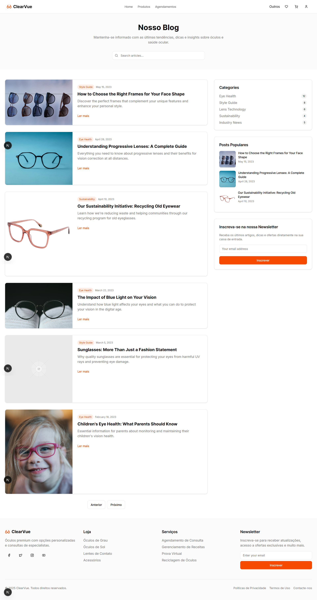
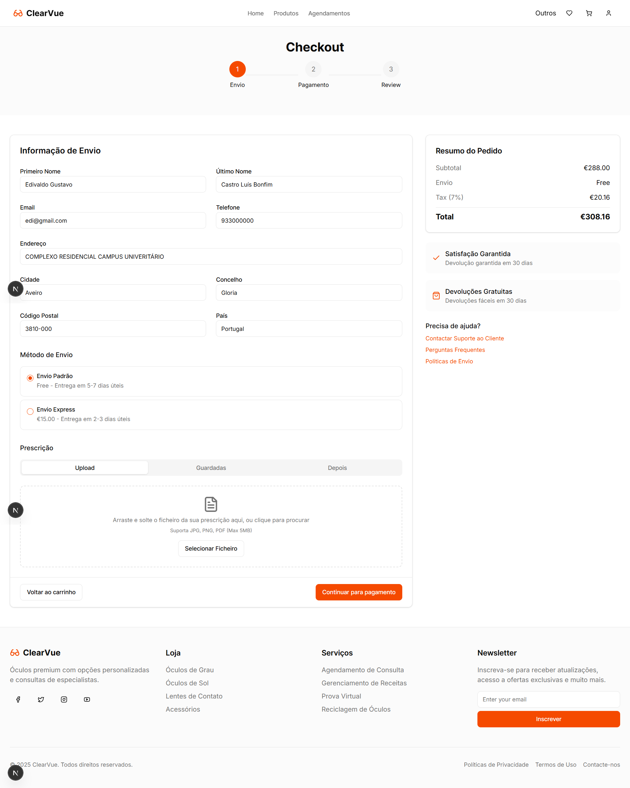
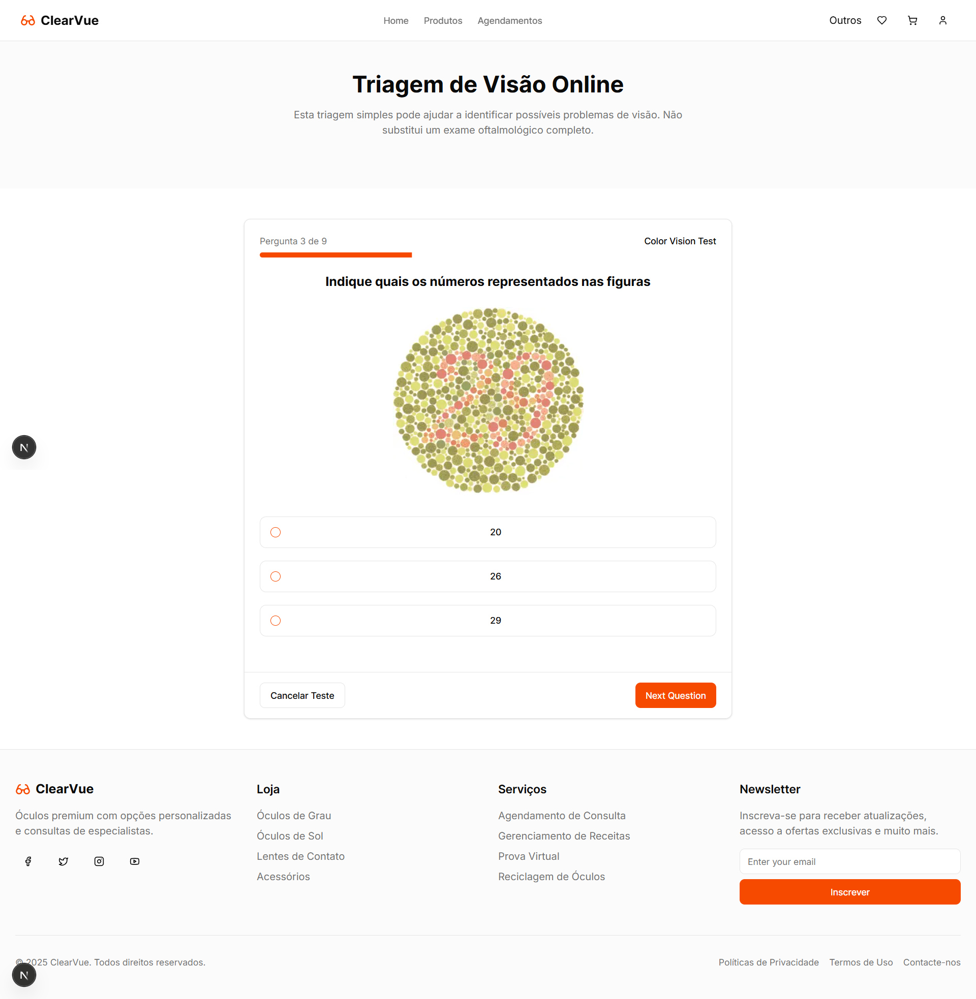

[Back to main Logbook Page](../hci_logbook.md)

---

# F. Discussion of Evaluation Results

# Refinement List
- **Group 1**: 
    - Simple and intuitive interface
    - Useful functionalities
    - Suggestion to add more notifications and fix some bugs in scheduling
- **Group 2**:
    - The feedbacks were similar to group 1, but they also suggested making some changes to the navigation menu, as we have a submenu "others" that is not very intuitive.

# Refined Prototype

## Home Page

## Favorites
 
## Products

## Blog
 
 
## Events

## Sustentability

## Appointments

## Cart

 

 
## Quick vision test 

 

## Login and Register
 

---
[Back to main Logbook Page](../hci_logbook.md)

---